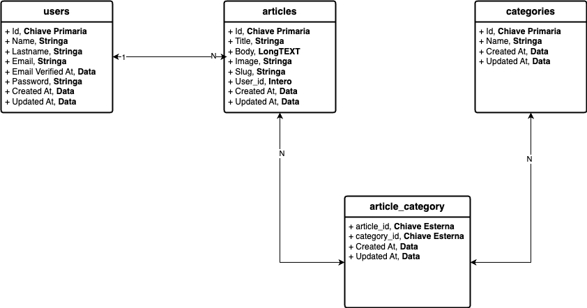

# Recap Relazioni Fortify
## Schema

## Dati
Articoli
- Title, Stringa - required
- Body, Longtext - required
- Image, String - required
- Slug, string - unique, required 
- User_id, int - FK

Categorie
- Name, Stringa - required

## **Traccia**

- Creare un **nuovo** progetto Laravel
- Utilizzare tutte le **best practice** usate finora
    - Named Routes
    - Controller
    - Components/Layout
        - Passare le categorie dentro il componente navbar
    - Scaffolding con **Vite**
    
    Autenticazione con **Laravel Fortify**
    
    - login
    - register
    - logout
    - password Dimenticata e Password Reset
    - Profilo 

- **CRUD** completo di **due modelli** Article e Category
    - index
    - create
    - store
    - show
    - edit
    - update
    - delete
- Relazione **One-to-Many** tra User e Article
- Relazione **Many-to-Many** tra Article e Category

EXTRA

- Dare la possibilità solo all'utente che ha creato l'entità di modificarla;
- Quando l’utente entra nella sua dashboard, mostrare solamente
- Ricerca di un articolo per titolo;